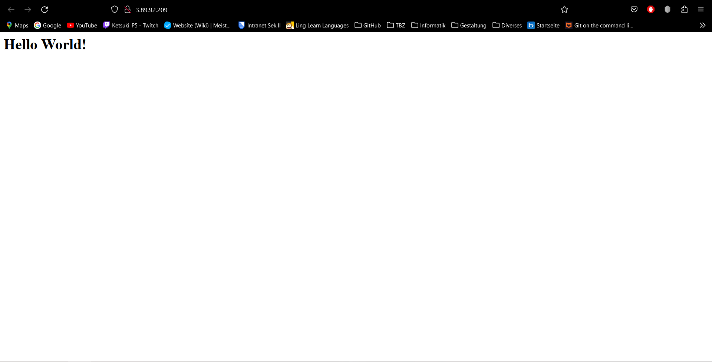
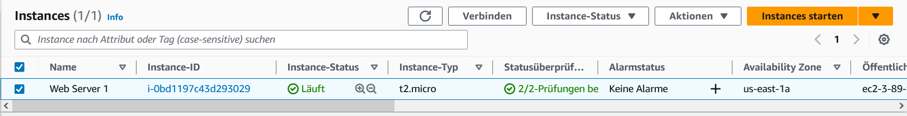
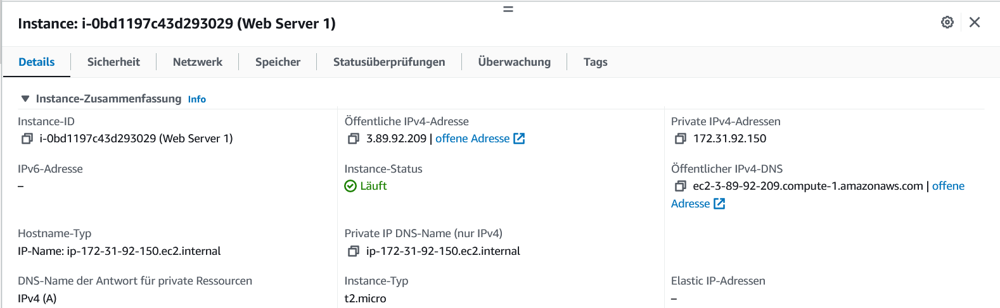
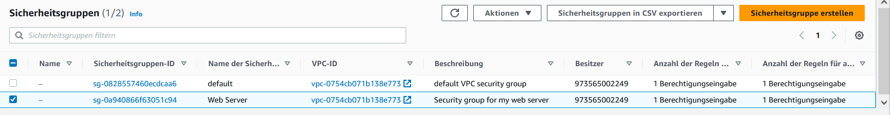

= KN02 Dokumentation - Tim

== HTML Seite mit URL

In diesem Bild wurde die Instanz erfolgreich gestartet.
In der URL wurde die öffentliche IP-Adresse eingegeben. Es versuchte dann mit https zu verbinden, was nicht klappte. Ich habe dann das s gestrichen und die Security akzeptiert und nun funktionierte die Seite.

== Instanzen

In diesem Bild stehen alle Instanzen, die jetzige Instanz ist am Laufen und der Status sieht ebenfalls gut aus.

== Instanz Details

Hier stehen die Details der Instanz. Am Wichtigsten ist die öffentliche IPv4-Adresse, damit kommt man zur Website.

== Inbound Rules

Zwar auf Deutsch, aber hier sind die Inbound Regeln.
Default ist unwichtig, aber Web Server ist die selbst erstellte Regel

