= KN02 Dokumentation - Tim

== a) Lab 4.1 - EC2

=== HTML Seite mit URL

In diesem Bild wurde die Instanz erfolgreich gestartet.
In der URL wurde die öffentliche IP-Adresse eingegeben. Es versuchte dann mit https zu verbinden, was nicht klappte. Ich habe dann das s gestrichen und die Security akzeptiert und nun funktionierte die Seite.

image::IMG/HTML_Seite_mit_URL.PNG[]

=== Instanzen

In diesem Bild stehen alle Instanzen, die jetzige Instanz ist am Laufen und der Status sieht ebenfalls gut aus.

image::IMG/EC2.PNG[]

=== Instanz Details

Hier stehen die Details der Instanz. Am Wichtigsten ist die öffentliche IPv4-Adresse, damit kommt man zur Website.

image::IMG/EC2_Details_mit_IPv4.PNG[]

=== Inbound Rules

Zwar auf Deutsch, aber hier sind die Inbound Regeln.
Default ist unwichtig, aber Web Server ist die selbst erstellte Regel

image::IMG/Inbound_rules.PNG[]

== b) Lab 4.2 - S3

=== Liste der Buckets

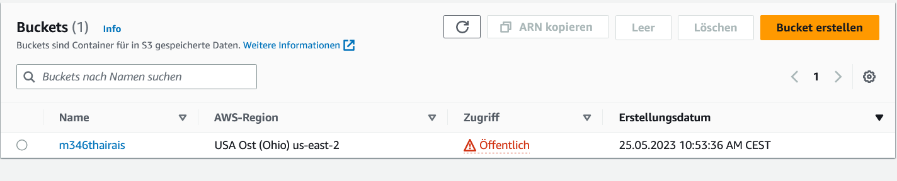

=== HTML Seite mit URL

In diesem Fall wurde die Seite des Buckets aufgerufen, die URL sieht anders aus.

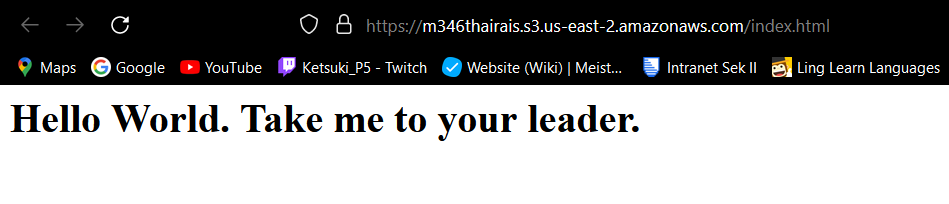

=== Liste der Dateien im Bucket

Buckets enthalten objects, welche Dateien sein können wie die HTML Seite.

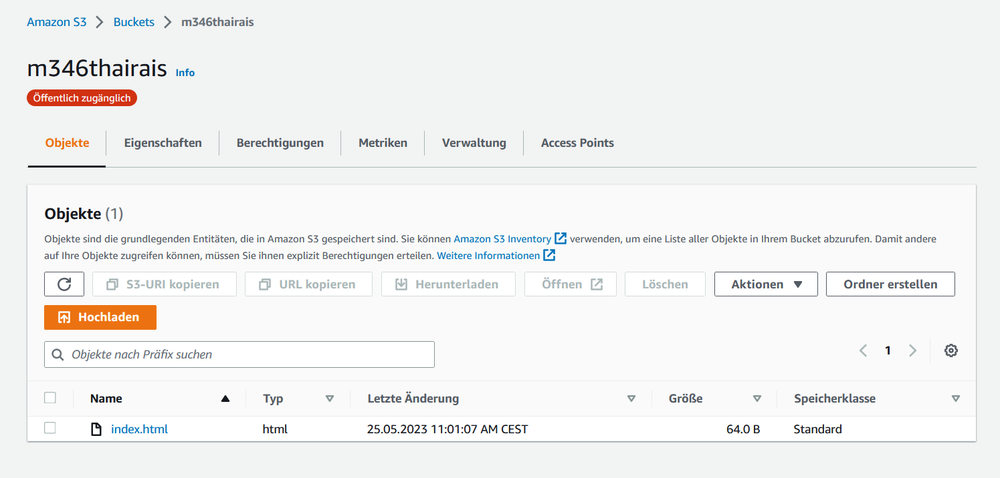

=== Eigenschaften von "Static Website Hosting"

Ein Mal die Infos.

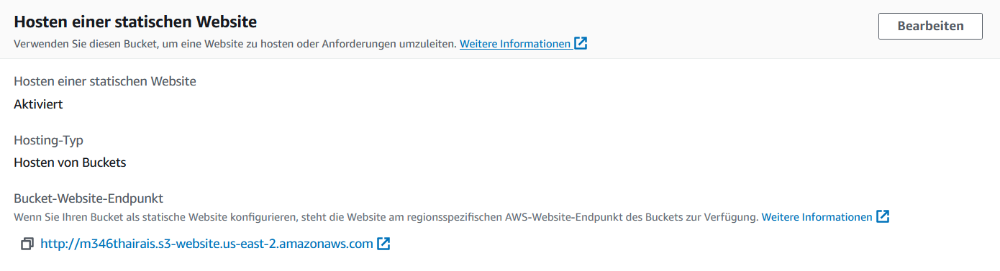

Ein Mal die Einstellungen.

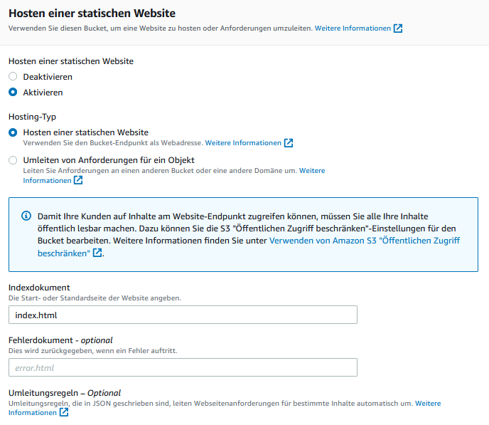

== B) Zugriff mit SSH-Key

=== SSH-Befehl mit erstem Key

Befehl mit dem 1. Key und als Resultat öffnet sich die Ubuntu Shell.

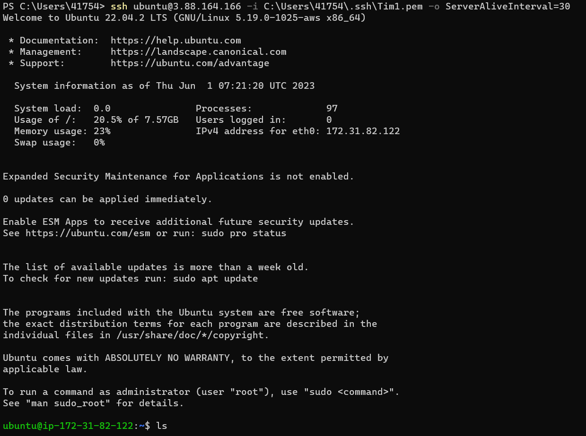

=== SSH-Befehl mit zweitem Key

Befehl mit dem 2. Key und als Resultat öffnet sich die Ubuntu Shell.

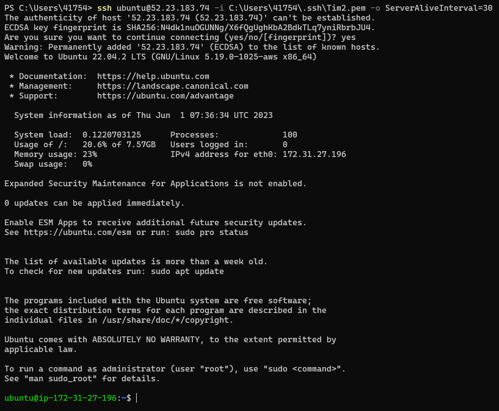

=== Details der Instanzen

Instanz 1 mit Key 1.

Instanz 2 mit Key 2.

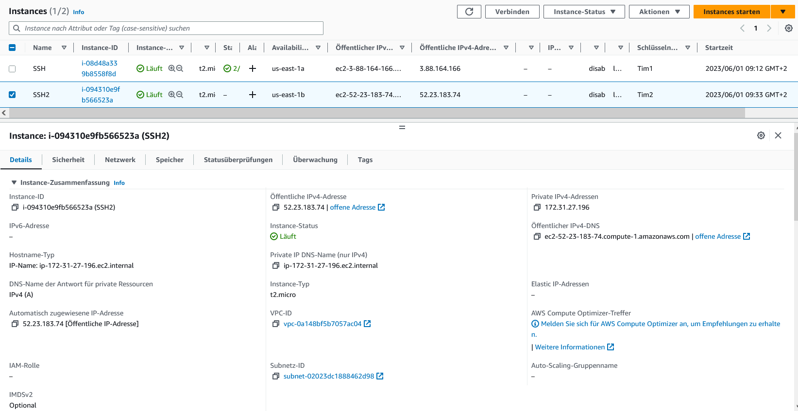

== C) Cloud-init Datei Verstehen

=== Code Kommentare

[source, yaml]
----
#cloud-config
users:  #Collection von Benutzern
  - name: ubuntu  #Der Benutzername des ersten Benutzers
    sudo: ALL=(ALL) NOPASSWD:ALL  #sudo Regeln für diesen Benutzer
    groups: users, admin  #Rollen für Benutzer
    home: /home/ubuntu  #Home Verzeichnis von Ubuntu
    shell: /bin/bash  #Festlegen der Shell Verzeichnis
    ssh_authorized_keys:  #Collection von autorisierten SSH Keys
      - ssh-rsa AAAAB3NzaC1yc2EAAAADAQABAAABAQC0WGP1EZykEtv5YGC9nMiPFW3U3DmZNzKFO5nEu6uozEHh4jLZzPNHSrfFTuQ2GnRDSt+XbOtTLdcj26+iPNiFoFha42aCIzYjt6V8Z+SQ9pzF4jPPzxwXfDdkEWylgoNnZ+4MG1lNFqa8aO7F62tX0Yj5khjC0Bs7Mb2cHLx1XZaxJV6qSaulDuBbLYe8QUZXkMc7wmob3PM0kflfolR3LE7LResIHWa4j4FL6r5cQmFlDU2BDPpKMFMGUfRSFiUtaWBNXFOWHQBC2+uKmuMPYP4vJC9sBgqMvPN/X2KyemqdMvdKXnCfrzadHuSSJYEzD64Cve5Zl9yVvY4AqyBD aws-key  #SSH Key
ssh_pwauth: false #Authentifizierung mit Passwort über SSH
disable_root: false #Ausschalten des Roots
package_update: true #Updates für Packages
packages: #Collection von Packages
  - curl  #Kommandozeilen Programm
  - wget  #Kommandozeilen Programm
----

== D) SSH-Key und Cloud-init

=== Verwendeter Key in Details

In den Details der Instanz wurde zum Start der zweite Key verwendet.

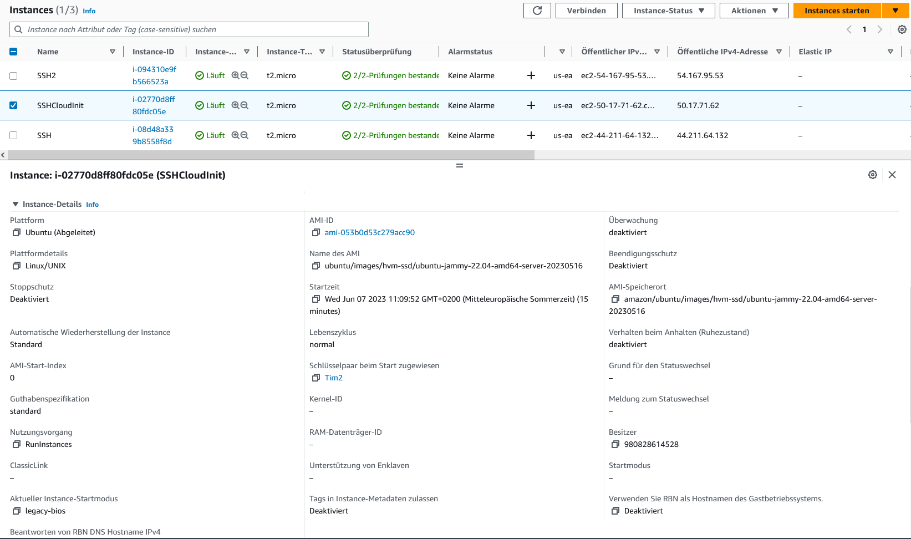

=== SSH-Befehl mit erstem Schlüssel

In der Cloud-Init File wurde jedoch der erste Key mitgegeben, über das CMD funktioniert er auch.

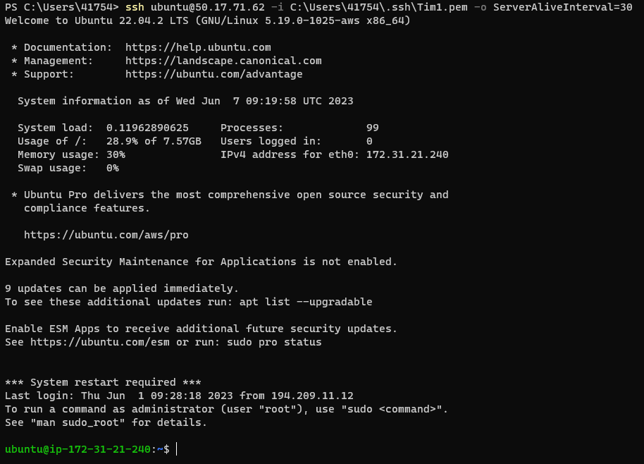

=== SSH-Befehl mit zweitem Schlüssel

Damit wurde auch erfolgreich der zweite Key "überschrieben", weswegen er hier nicht mehr funktioniert.

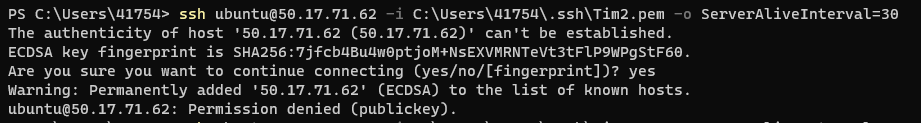