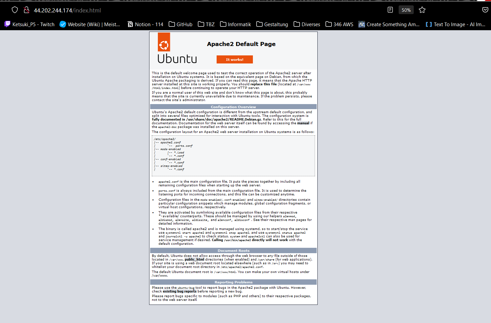
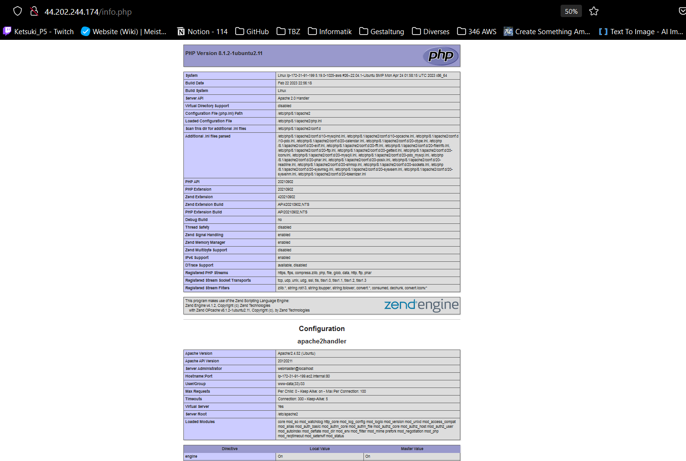
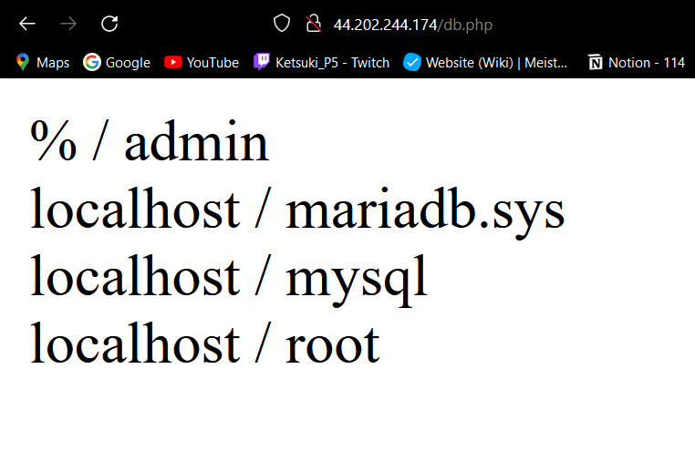

= KN03 Dokumentation - Tim

//ssh ubuntu@<ip_of_instance> -i C:\Users\41754\.ssh\Tim1.pem -o ServerAliveInterval=30

== A) Installation von Web- und Datenbankserver

== B) Auftrennung von Web- und Datenbankserver

== C) Speicher