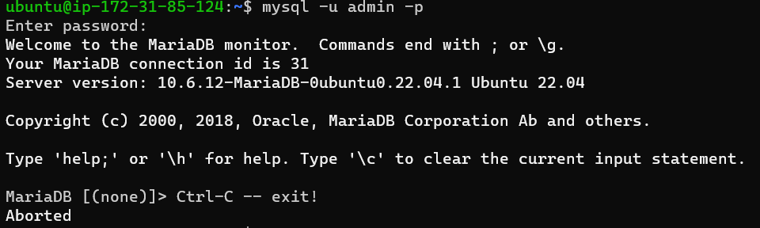
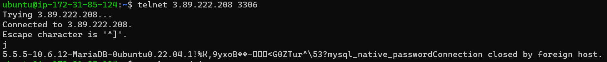
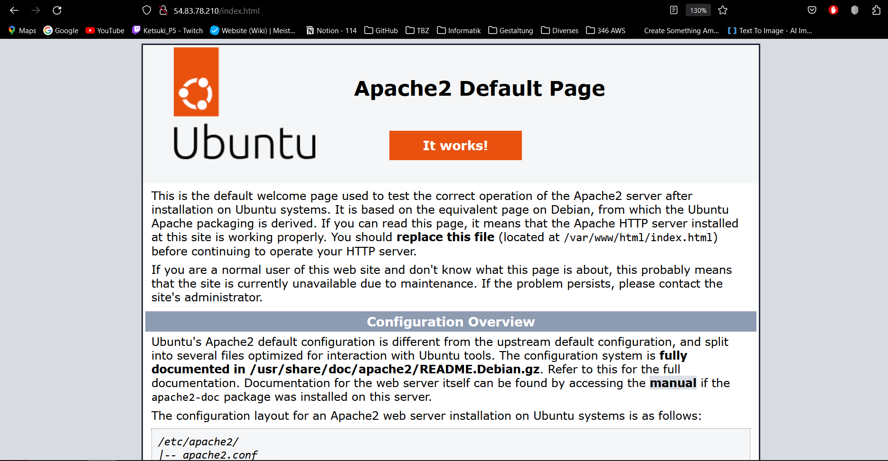
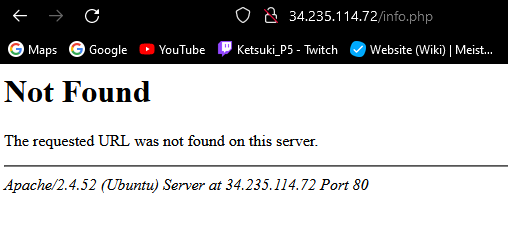
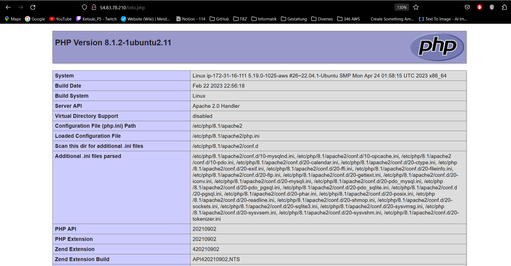
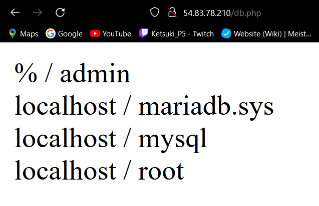
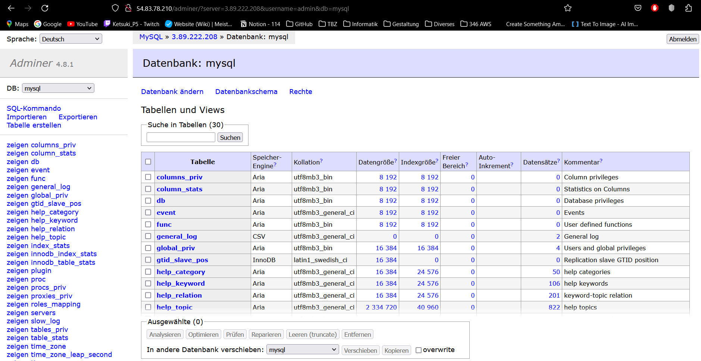
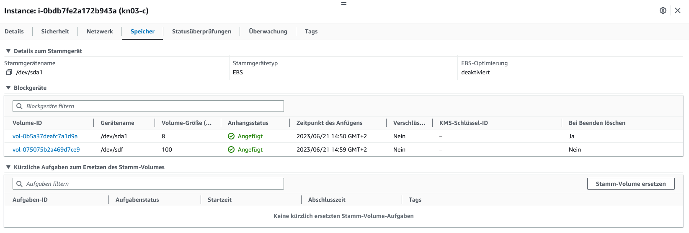
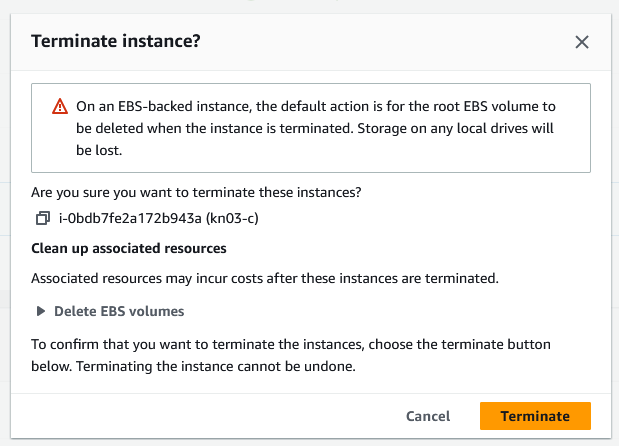
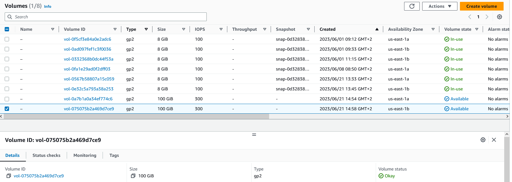

= KN03 Dokumentation - Tim

//ssh ubuntu@<ip_of_instance> -i C:\Users\41754\.ssh\Tim1.pem -o ServerAliveInterval=30

== A) Installation von Web- und Datenbankserver

image::IMG/A/index_html.PNG[]

image::IMG/A/info_php.PNG[]

image::IMG/A/db_php.PNG[]

== B) Auftrennung von Web- und Datenbankserver

Ich bin mir nicht ganz sicher ob das richtig ist, für mich war das jedenfalls ein besseres Ergebnis als vorher, weil vorher gab es mir nur Request Timed out und jetzt sagt es mir, dass es wieder geschlossen wird.

Im Webserver scheint die HTML Seite jedes mal zu klappen.

Allerdings funktionierte es nie bei info.php, db.php und beim Adminer, dort erhielt ich jedes mal die Error Message Not Found.

=== Korrektur

Ich habe es mir nochmals angeschaut und die Cloud-init Datei für den WebServer überarbeitet und jetzt funktioniert alles!

image::IMG/B-working/adminer-login-info.PNG[]

== C) Speicher

1x Volume durch das Erstellen der Instanz
1x Volume mit 100 GB welches angefügt wurde

Die Warnung sagt einem, dass standardmässig beim Löschen einer Instanz, auch das Root Volume, also das Volume womit die Instanz erschaffen wurde, ebenfalls gelöscht wird und deswegen alle Speicher und lokalen drives verloren gehen.

Mir fehlt zwar noch ein Screenshot bevor der Löschung, aber hier gab es vorher ein Volume mit 8 GB welches jetzt gelöscht wurde. Wenn man auf die Zeiten achtet wäre es ungefähr zur gleichen Zeit wie die neuste, welche übrigens noch vorhanden ist. Ich erkläre das mir so, dass das neue Volume nicht mehr lokal ist und auch keine Einstellungen zur Instanz beinhaltet, weswegen es weiter existiert und weiter verwendet werden kann.

