= KN04 Dokumentation - Tim

//ssh ubuntu@<ip_of_instance> -i C:\Users\41754\.ssh\Tim1.pem -o ServerAliveInterval=30

== A) Netzwerk und Sicherheit Einrichten

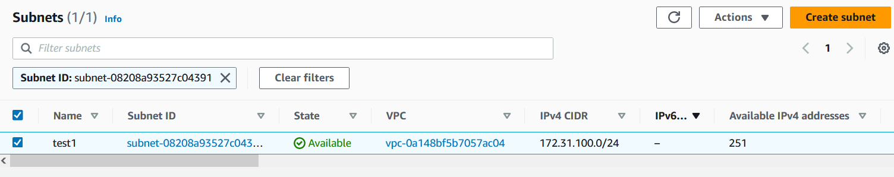

ep1 = DB +
ep2 = Web

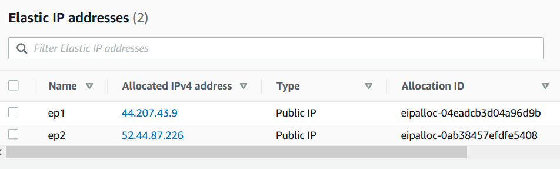

Inbound rules von der Web Security Group

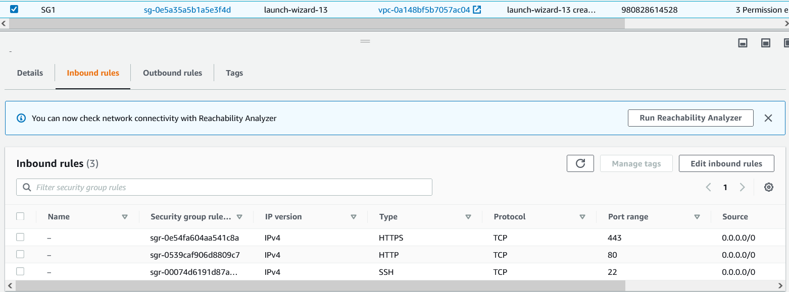

Inbound rules von der DB Security Group

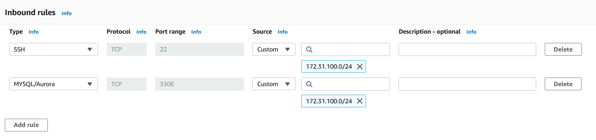

Erste Spalte ist die DB und die letzte der Webserver

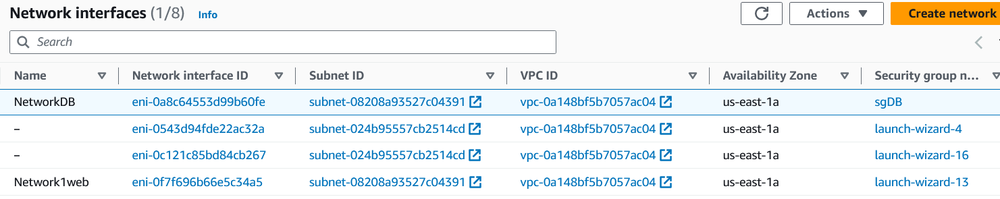
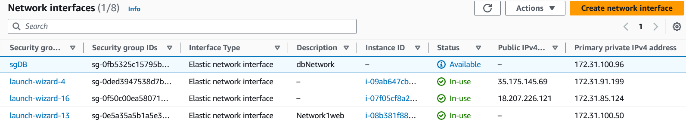

Webserver Instanz

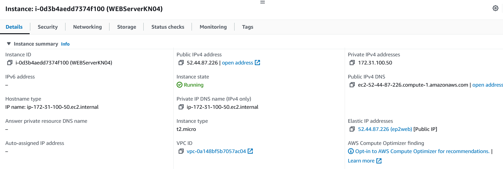

DBserver Instanz

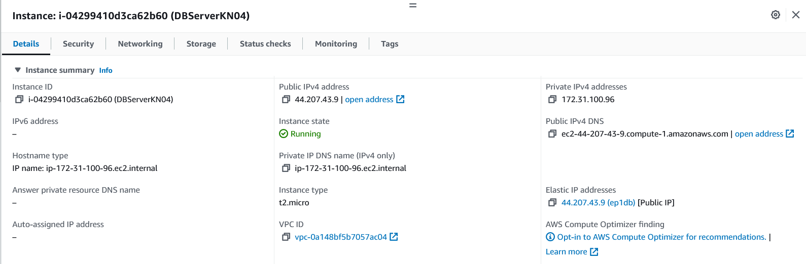

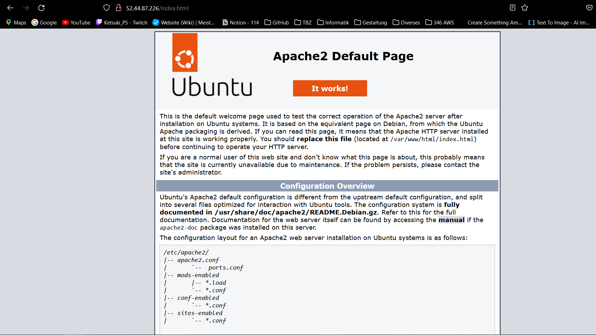
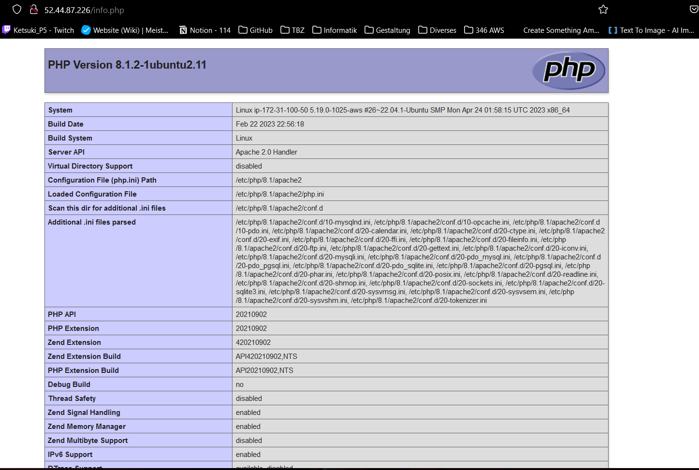
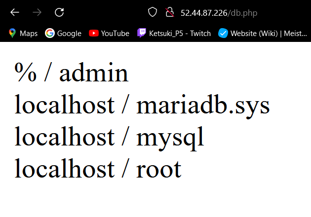
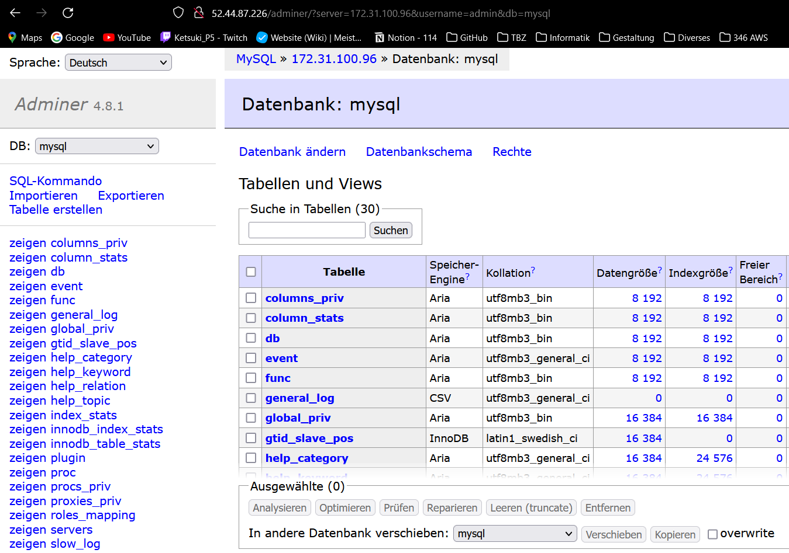