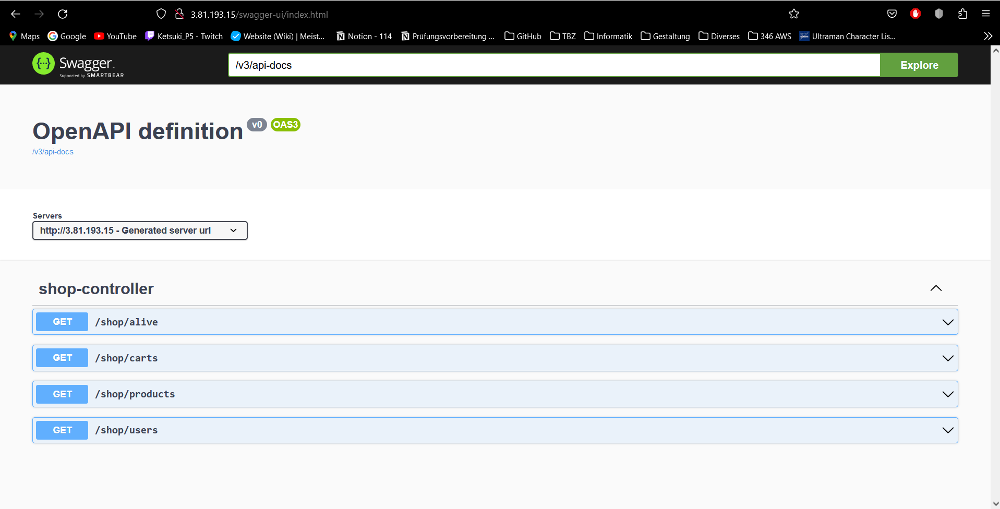
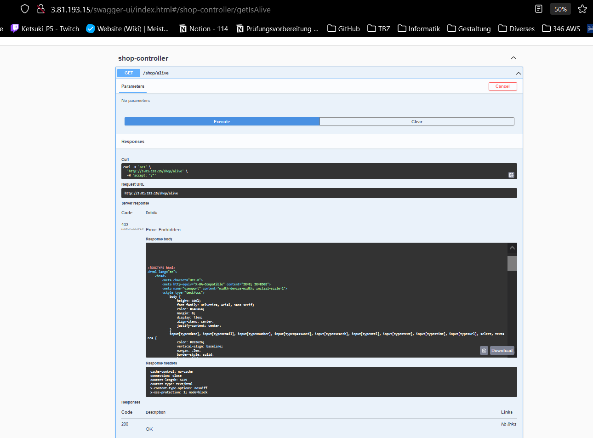
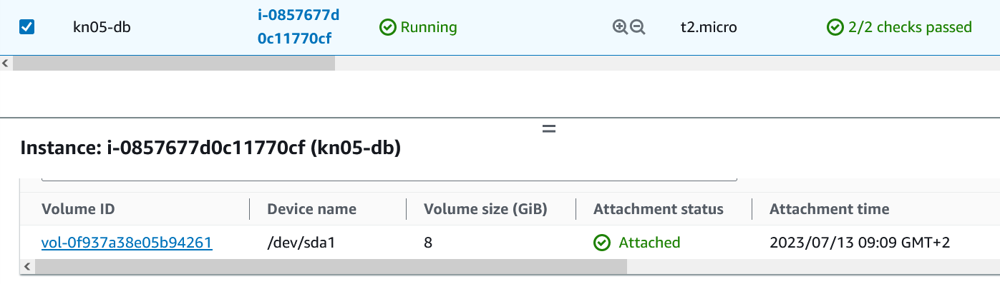
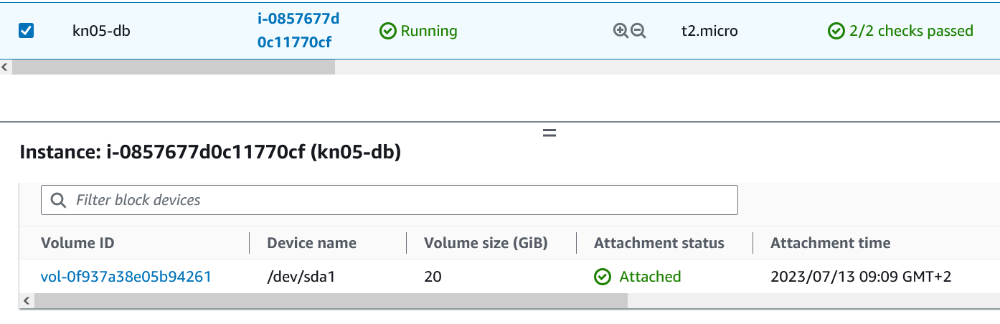
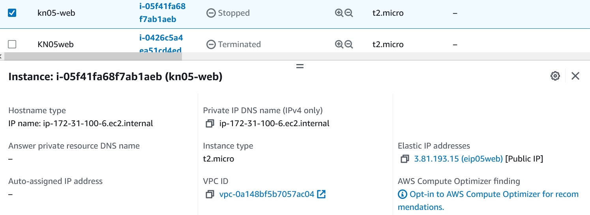
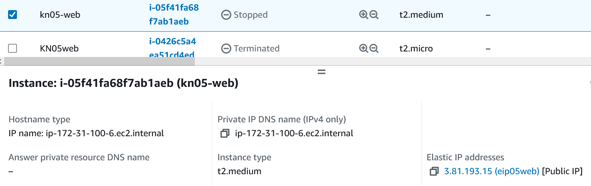

= KN05 Dokumentation - Tim

== A) Installation App

Es haben sich nur die Cloud-Init Files geändert.
Wie KN04 habe ich Network Interface, Security Group und Elastic IP erstellt und es den neuen Instanzen zugewiesen.

== B) Vertikale Skalierung

vorher

nachher

vorher

nachher

== C) Horizontale Skalierung

== D) Auto Scaling