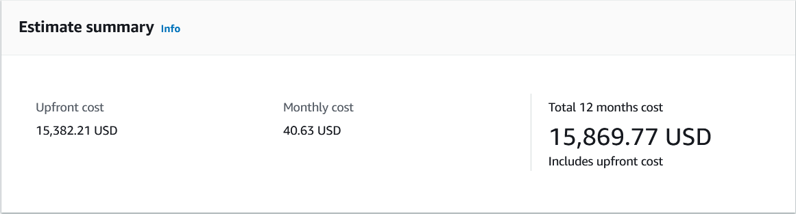
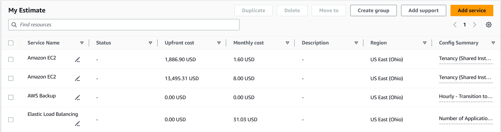
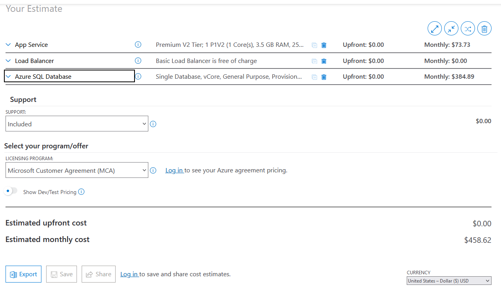
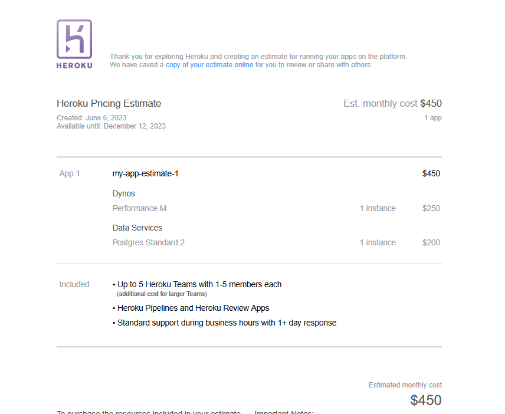
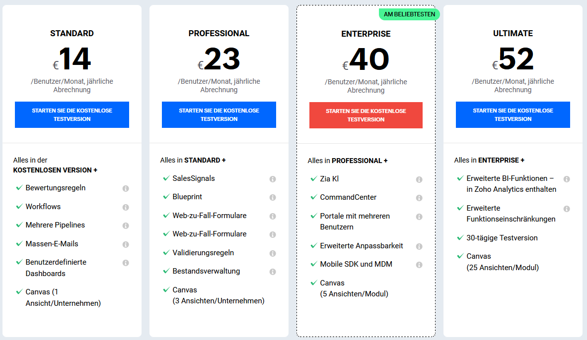
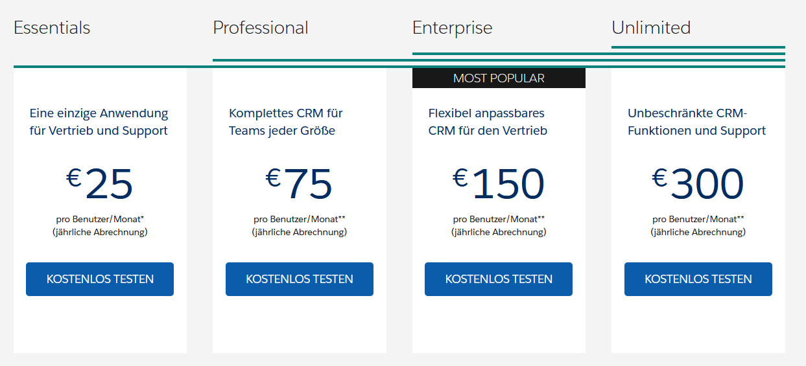

= KN06 Dokumentation - Tim

== A) Kostenrechnung erstellen

=== 1) Rehosting

==== AWS

Es wurde der Standort Ohio ausgewählt, kein spezifischer Grund warum.
Die Kosten enstehen hauptsächlich aus dem Web Server und DB Server.
Für den Backup habe ich nur Zeiten gewählt und er bietet es gratis an.

==== Azure

Bei Azure gab es nicht so viele Möglichkeiten es auf die Anforderungen zu konfigurieren.
Zum Beispiel hat man nur Tiers für den Web Server, man kann es nicht einzeln konfigurieren und man wird gezwungen eine fixe Vorgabe auszuwählen. Der Backup-speicher ist in der Datenbank mitdabei, was nett ist, aber leider gibt es nicht die Auswahl für tägliches speichern

=== 2) Replatforming

Heroku war ähnlich wie Azure.
Also es gab verschiedene Pakete die man auswählen konnte und ich habe mir für den Web Server das Performence M ausgewählt, weil es die 2,5 GB RAM erfüllt und Postgres Standard 2, weil es mindestens 100 GB Speicher hat, der Rest wäre zu niedrig gewesen.

=== 3) Repurchasing

Zoho ist im Vergleich zu Salesforce viel günstiger und man könnte sich hier überlegen die 40 Euro zu zahlen, mal 16 Mitarbeiter wären das dann 640 Euro.
Es ist günstiger und hat dabei noch ziemlich viele Funktionen, Bestseller.

Es kann ziemlich teuer werden, deswegen tendiere ich eher zu den 25 Euro, mal 16 Mitarbeiter wären das dann 400 Euro.

Gegenüberstellung der SaaS-Lösung zu IaaS und PaaS Lösungen von vorher. Welches wählen Sie und wieso? Was müsste man zusätzlich beachten?

Mir hat (IaaS) Amazon ziemlich gut gefallen, weil man alles konfigurieren konnte aufs kleinste Detail, damit es genau so wird wie man es sich vorstellt, aber es wurde sehr teuer, zumindest bei mir.

Azure war da gemütlich von den Preisen her und der Auswahl, man muss dort aber beachten welches Tier man nimmt, weil man einzelne Sachen, wie Speicher oder RAM nicht selber einstellen kann, sondern einen fixen Wert auswählt.

== B) Interpretation der Resultate

==== Wie stark unterscheiden sich die Angebote?

Zum Teil sehr, zum Teil ist es ähnlich, ich glaube bei Amazon hab ich irgendetwas falsch eingestellt. Azure und Heroku sind aber ziemlich gleich. Zoho und Salesforce unterscheiden sich stark voneinander, aber sie kommen auch ungefähr auf den gleichen Betrag wie Azure und Heroku.

==== Welches ist das billigste?

Zoho war das Billigste für 25 Euro pro Monat.

==== Wieso ist eines davon viel teurer? Ist es aber wirklich teurer?

Amazon, 15'000$ upfront, also direkt und dann monatlich 40$ ist sehr viel teurer.
Aber das hängt glaube ich damit zusammen, dass es noch irgendein Deal gab mit der Datenbank für paar Jahren und das man ALLES konfigurieren konnte, aber es ist trotzdem sehr teuer.